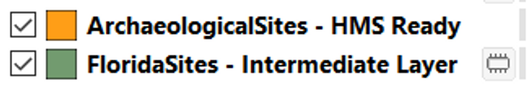

# Introduction

The HMS database is populated with exports from the [Florida Site Master File](https://github.com/legiongis/fpan-data/blob/master/dos.myflorida.com/historical/preservation/master-site-file) (FMSF). Only three categories of resources from the FMSF are used:

- Archaeological Sites
- Historic Structures
- Historic Cemeteries

We have developed a QGIS Python plugin to facilitate the workflow for regularly updating the HMS database from FMSF exports.

The plugin does not directly load new resources into HMS, but it creates CSV files that can be loaded through the command line interface.

## Installing the Plugin

The quickest way to install the plugin is from a zipped version of the Github repo. Alternatively, if you are familiar with Git, you can clone the repo directly into your QGIS plugins directory.

### From .zip

*Use this same process for upgrading the plugin if you have already installed it. The existing installation will be overwritten.*

1. Download this zipfile: [fmsf2hms.zip](https://github.com/legiongis/fmsf2hms/releases/download/v0.1-beta.3/fmsf2hms.zip).
2. In QGIS, open the Plugin Manager.
3. Choose the "Install from ZIP" option, and install the downloaded file.
4. You can now find the tools in **Vector → FMSF - HMS.**

### With Git

1. Find your QGIS plugins directory. On windows, it should be something like:
    
    `C:\Users\<username>\AppData\Roaming\QGIS\QGIS3\profiles\default\python\plugins`
    
2. Clone the legiongis/fmsf2hms repo into that directory.
    
    If you have `git` installed, this can be done in the command line:
    
    ```
    cd C:\Users\<username>\AppData\Roaming\QGIS\QGIS3\profiles\default\python\plugins
    git clone https://github.com/legiongis/fmsf2hms
    ```
    
    Alternatively, there are many GUI options for Git: https://www.thewindowsclub.com/git-gui-clients-for-windows
    
3. In QGIS, open the Plugin Manager, and search for "FMSF"
4. You should see the "FMSF - HMS" plugin available. Check the box to enable it.

---

Once the plugin is installed, you'll be able to find it in the **Vector** menu.


The FMSF - HMS tools can be found in the default Vector menu.

## Getting FMSF Data

Ahead of any update to the HMS, you'll need to request data from the FMSF. You must request shapefiles for:

- Archaeological Sites
- Historic Cemeteries
- Historic Structures

Additionally, you must ask for one extra non-spatial table:

- Ownership Type

---

When you receive the FMSF data, you must convert the ownership table (OwnType.xslx) to a CSV. Open it in MS Excel, then **Save As → CSV (Comma delimited) (*.csv).** Place the new file in the same directory. When you have files matching those shown below, you are ready to begin the process.


Unzipped contents of an FMSF data request to prepare for an HMS update with the converted OwnType CSV. The metadata files are not used by the plugin, but may be present in your FMSF export.

## Using the Plugin

For each of the three resource types, using the plugin is a **three-step** process.

1. Filter the FMSF shapefile
    - Use the appropriate filter tool for each resource type
2. Check the geometry in the filtered layer
    - This must be done manually using tools in QGIS
3. Write out the HMS-ready CSV
    - When the filtered layer's geometry has no errors, you can finish the process by writing the CSV

## Filtering FMSF Shapefiles

Each of the resource types has its own tool, but the process is basically the same for each: Provide the FMSF shapefile and owner type CSV, and the tool will produce a new "Intermediate Layer" in the map view. You can find detailed information on each tool below or jump to the next step, [fixing geometries](#fixing-geometries).

### Filter Cemeteries

This tool takes the input FMSF data and outputs a CSV that is HMS-ready. The output file only includes cemeteries that are not yet in the HMS.


*screenshot may need an update*

| Parameter Name | Description |
| --- | --- |
|FMSF Historic Cemetery Export (.shp) | The Historic Cemetery shapefile received from FMSF |
|Add input layer to map | Option to add the FMSF layer to the current map view |
|Owner Type Spreadsheet (.csv) | The OwnType.csv file created at the beginning of the process |
    

### Filter Archaeological Sites

This tool takes the input FMSF data and outputs a CSV that is HMS-ready. The output file only includes archaeological sites that are not yet in the HMS.


*screenshot may need an update*

| Parameter Name | Description |
| --- | ---|
|FMSF Archaeological Site Export (.shp) | the Archaeological Site shapefile received from FMSF
|Add input layer to map | option to add the FMSF layer to the current map view
|Owner Type Spreadsheet (.csv) | the OwnType.csv file created at the beginning of the process|


### Filter Historic Structures

This tool takes the input FMSF data and outputs a CSV that is HMS-ready. The output file only includes historic structures that are not yet in the HMS. Unlike the Historic Cemetery and Archaeological Site resource types, where the intention is to have the HMS contain *all* FMSF records, only a small subset of Historic Structures are to be included in the HMS program. A more detail explanation of this follows.


*screenshot may need an update*

| Parameter Name | Description |
| --- |--- |
| FMSF Historic Structure Export (.shp) | the Historic Structure shapefile received from FMSF |
|Add input layer to map | option to add the FMSF layer to the current map view |
|Owner Type Spreadsheet (.csv) | the OwnType.csv file created at the beginning of the process |
|SITEID List (.csv) | an optional CSV file containing a list of individual Site IDs |

#### Filtering Operations

A number of rules are applied to the FMSF structure dataset so that the HMS only includes structures that

- are...
    - lighthouses
    - or located in...
        - State Parks
        - any NR district in St. Augustine
        - any NR district in Fernandino Beach
        - Pensacola Historic District or Palafox Historic District (both in Pensacola)
    - or listed in the input SITEID CSV
        - The only requirement for this CSV file is that the site ids are stored in a field named `SITEID` (upper case).
- and have not been demolished

<aside>
📌 This tool takes a few minutes to run so please be patient, even if it seems like QGIS has frozen up.

</aside>

## Fixing Geometries

Each of the filter tools above will produce a temporary layer in the table of contents. These layers contain all of the new resources that will be added to HMS, however, some manual corrections may be necessary. This is because the underlying search engine that Arches uses, Elasticsearch, is *very* picky about using "valid" geometries, much more so than ArcMap or QGIS, and the FMSF data will contain invalid geometries.

<aside>
⚠️ The two most common geometry errors we've seen in FMSF data are duplicate nodes and intersecting boundaries within polygons. Generally, there are no problems with point layers (Historic Structures).

</aside>

### QGIS Tools to Use

The best tool to use to find geometry errors is called **Check validity**. Run it on the temporary layer, and, most importantly, you must run it with the **Method set to QGIS**. The GEOS method does not catch all of the errors that Elasticsearch will have trouble with.


The easiest way to find this tool is to search for it in the Processing Toolbox.

---

 When you have run the tool, the results will look something like this:


The tool will output layers illustrating the geometry errors. You will need to fix each one by directly editing the intermediate layer.

The easiest way to find this tool is to search for it in the Processing Toolbox.

## Writing the HMS CSVs

rtgbvlWhen the geometries have been corrected in the intermediate layer, the final step is to write the final file using the Write HMS CSV tool. The process is very simple: Select the intermediate layer in the Layers panel, setwhat type of resources are in that layer, and define an output directory.


Make sure that the correct intermediate layer is selected in the Layers panel

---

When the tool finishes, the final file will be written to the output directory with a name like `ArchaeologicalSites-hms.csv` and will also be added to the Layers panel with a name like "ArchaeologicalSites - HMS Ready"



The layer on top represents the final CSV, the intermediate layer below can now be safely discarded.

When you have written the CSV file for each resource type, the entire set is now ready to be loaded into the HMS database.

## **Update FMSF/HMS Lookups**

This tool updates a lookup list that links FMSF Site IDs with HMS resource ids. This lookup table only needs to be updated after new resources have been loaded into HMS.

<aside>
📌 The plugin ships with a lookup table, so there's a good chance you will never need to run this tool. If you do, be aware that it takes a few minutes to run so please be patient, even if it seems like QGIS has frozen up.

</aside>

## Credits

Icons made by [Smashicons](https://www.flaticon.com/authors/smashicons) from [www.flaticon.com](http://www.flaticon.com/).

Plugin created by Adam Cox, [Legion GIS, LLC](https://legiongis.com). More details about its development [here](creating-the-plugin.md).